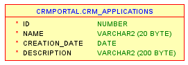
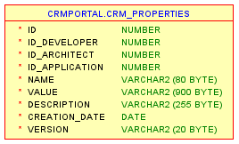
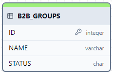
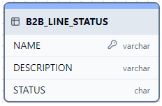

# Diseño técnico Parametrización. 

## Tareas en diseño a elaborar:

- Evaluar el funcionamiento de CRM Properties vs Base de Datos
- Elaboracion del MER para la gestion de la parametrizacion. 
- Definir la estrategia de configuracion de atributos
- Definir el diagrama de clases.

##  Entregables

+ Modelo Entidad Relacion 
+ Diagrama de clases 

## Requisitos Impactados 

* RF-001
* RF-003
* RF-004
* RF-005
* RF-006
* RF-007
* RF-008
* RF-009
* RF-010
* RF-011

## Decisiones de Arquitectura

#### Evaluar el funcionamiento de CRM Properties vs Base de Datos?

Al iniciar el diseño de la solución, se plantearon 3 formas de solucionar la configuración de parametros 

1. Properties CRM 

> El componente gestiona las propiedades del portal CRM. Cada propiedad es accedida a traves de una clave y un Id. La solución se encuentra desplegada en el entorno de Sostenibilidad. 
2. Modelo de parametros a traves de MAESTRO/DETALLE 

> El componente es completamente nuevo. Se implementaria una solucion en base de datos, la cual contiene dos tablas. La tabla maestro tiene identificado la definicion del parametro. La tabla detalle contiene la definición de los valores que puede tener el parametro. 

3. Modelo personalizado de parametros.

> El componente es completamente nuevo. Se implementaria una tabla en base de datos la cual detalla el comportamiento de cada parametro. 

<b>Se selecciona la solucion Properties CRM, dado a que es un modelo basado en servicio, el cual se encuentra estable y se encuentra alineado a la arquitectura del proyecto.</b>

## Nuevo Pospago B2B / Parametrización

Se hara uso del proyecto APP-PropiedadesCrm el cual contiene la estructura para gestionar las propiedades del sistema. 

El proyecto se encuentra en la ruta: 

http://gitlab2.tigoune.com:9004/Accenture-T2/CRMSostenibilidad/APP-PropiedadesCrm.git

La documentación del proyecto se encuentra en: 

https://tigoco.atlassian.net/wiki/spaces/DI/pages/697991445/PropiedadesCRM-EJB

Dentro de la documentación se indica como se debe incluir el proyecto como dependencia. A continuación se cita dicha información: 

### PropiedadesCRM-EJB.jar: 

Para hacer uso del jar se debe incluir la siguiente dependencia en el proyecto maven con un scope provided. Esto para compilar proyectos en tiempo de ejecución se despliega componente en los EAP Back de Sostenibilidad

> <b>groupId:</b>co.com.tigo.crm.PropiedadesCRM 
<b>artifactId:</b>PropiedadesCRM-EJB 
<b>version:</b>1.0.0 
<b>scope:</b>provided 

## Casos de uso(opcional)
    
    <Describa los pasos o las actividades que deberán realizarse para solución a los requisitos especificados. Los casos de uso no son obligatorios, estos se realizan cuando se considere necesario dar claridad sobre las acciones a ejecutar en el sistema>

* Nombre:	
* Complejidad:
* Alta
* Descripción:
* Actores:
* Sistema	Documentos asociados:
* Precondiciones:
* Post-condiciones:
* Reglas de Negocio
* Flujo básico:
* Flujos alternos:
* Manejos de situaciones anormales:
* Trazabilidad con requisitos

## Diagrama de componentes

    <Si hay cambios en la aplicación existente, presentar los componentes del sistema y el impacto sobre estos por la implementación del requerimiento. Se debe dar una descripción completa de este impacto.>

## Diagrama de paquetes

    < Si hay cambios en la aplicación existente, Diagrama de paquetes, es preferible que en el diagrama de clases se identifique los paquetes, si se hace en el diagrama de clases no es necesario hacer este diagrama>

## Diagrama de clases

    < Si hay cambios en la aplicación existente, descripción de las clases impactadas por la implementación del requerimiento. Queda abierta la decisión del nivel del detalle de acuerdo a las necesidades del requerimiento y su nivel de madurez, mínimamente se espera el nombre de la clase y sus relaciones.>

## Descripción detallada del cambio a nivel de bases de datos

### DDL

> - Para la mayoria de requisitos se utilizaran dos tablas existentes del schema CRMPORTAL. Las tablas son CRM_APPLICATIONS,CRM_PROPERTIES
> - Se crearan 2 tablas: 

#### RF-009

-- Crear la tabla
> CREATE TABLE B2B_GROUPS (
ID INTEGER NOT NULL PRIMARY KEY,
NAME VARCHAR2(50),  
STATUS CHAR(1)
);

-- Añadir comentarios a las columnas
> + COMMENT ON COLUMN B2B_GROUPS.ID IS 'Identificador único para el grupo, generado por la secuencia';
> + COMMENT ON COLUMN B2B_GROUPS.NAME IS 'Nombre del grupo';
> + COMMENT ON COLUMN B2B_GROUPS.STATUS IS 'Estado del grupo: puede ser activo (A) o inactivo (I)';

#### RF-010

-- Crear la tabla B2B_LINE_STATUS
> CREATE TABLE B2B_LINE_STATUS (
NAME VARCHAR2(255) NOT NULL PRIMARY KEY,  -- Clave primaria
DESCRIPTION VARCHAR2(500),  -- Descripción del estado de la línea
STATUS CHAR(1)  -- Estado del registro: activo (A) o inactivo (I)
);

-- Añadir comentarios a las columnas
> COMMENT ON COLUMN B2B_LINE_STATUS.NAME IS 'Nombre único que identifica el estado de la línea';
COMMENT ON COLUMN B2B_LINE_STATUS.DESCRIPTION IS 'Descripción detallada del estado de la línea';
COMMENT ON COLUMN B2B_LINE_STATUS.STATUS IS 'Estado del registro: activo (A) o inactivo (I)';

### DML 

Para la configuración de las parametrizaciones se consideraran 2 tablas del schema CRM_PORTAL

<b>CRM_APPLICATIONS</b>: Se creará un ID de la aplicación del Nuevo Pospago B2B

> INSERT INTO CRM_APPLICATIONS
(ID,NAME,CREATION_DATE,DESCRIPTION)
VALUES
('26','NUEVO POSPAGO B2B',SYSDATE,'NUEVO PRODUCTO EMPRESARIAL POSPAGO');

<b>CRM_PROPERTIES</b>: Se crearan registros para modelar el comportamientos de las parametricas definidas. A su vez, cada parametrica se encuentra asociada a un requisito.

* RF-001

> INSERT INTO CRM_PROPERTIES (
ID,
ID_DEVELOPER,
ID_ARCHITECT,
ID_APPLICATION,
NAME,
VALUE,
DESCRIPTION,
CREATION_DATE,
VERSION
) VALUES (
***** SEQUENCE_NAME *********,
1, -- ID_DEVELOPER
1, -- ID_ARCHITECT
26, -- ID_APPLICATION
'TIPOS_CONTRATO', -- NAME
'Contrato Estándar=B2B_CESTANDAR ; Contrato Negociado=B2B_CNEGOCIADO', -- VALUE
'Tipos de contrato definidos', -- DESCRIPTION
SYSDATE, -- CREATION_DATE
'1' -- VERSION
);

* RF-003

> INSERT INTO CRM_PROPERTIES (
  ID,
  ID_DEVELOPER,
  ID_ARCHITECT,
  ID_APPLICATION,
  NAME,
  VALUE,
  DESCRIPTION,
  CREATION_DATE,
  VERSION
  ) VALUES (
  ***** SEQUENCE_NAME *********, 
  1, -- ID_DEVELOPER
  1, -- ID_ARCHITECT
  26, -- ID_APPLICATION
  'PLANES', -- NAME
  'Postpago Empresarial=B2B_POSP_EMP', -- VALUE
  'Planes Empresariales', -- DESCRIPTION
  SYSDATE, -- CREATION_DATE
  '1' -- VERSION
  );

* RF-004

> INSERT INTO CRM_PROPERTIES (
ID,
ID_DEVELOPER,
ID_ARCHITECT,
ID_APPLICATION,
NAME,
VALUE,
DESCRIPTION,
CREATION_DATE,
VERSION
) VALUES (
***** SEQUENCE_NAME *********,
1, -- ID_DEVELOPER
1, -- ID_ARCHITECT
26, -- ID_APPLICATION
'LINEA_PRODUCTO', -- NAME
'ESTÁNDAR=B2B_LPESTANDAR; AVANZADO=B2B_LPAVANZADO', -- VALUE
'Línea de producto', -- DESCRIPTION
SYSDATE, -- CREATION_DATE
'1' -- VERSION
);

* RF-005

> INSERT INTO CRM_PROPERTIES (
ID,
ID_DEVELOPER,
ID_ARCHITECT,
ID_APPLICATION,
NAME,
VALUE,
DESCRIPTION,
CREATION_DATE,
VERSION
) VALUES (
***** SEQUENCE_NAME *********,
1, -- ID_DEVELOPER
1, -- ID_ARCHITECT
26, -- ID_APPLICATION
'TIPO_FAMILIA', -- NAME
'MÓVIL=B2B_TFMOVIL; IoT=B2B_TFIOT', -- VALUE
'Tipos de familia', -- DESCRIPTION
SYSDATE, -- CREATION_DATE
'1' -- VERSION
);

* RF-006

> INSERT INTO CRM_PROPERTIES (
ID,
ID_DEVELOPER,
ID_ARCHITECT,
ID_APPLICATION,
NAME,
VALUE,
DESCRIPTION,
CREATION_DATE,
VERSION
) VALUES (
***** SEQUENCE_NAME *********,
1, -- ID_DEVELOPER
1, -- ID_ARCHITECT
26, -- ID_APPLICATION
'TIPO_PRODUCTO', -- NAME
'B2B_TFMOVIL=[NUEVO PRODUCTO POSTPAGO=B2B_TPNUEVOPOSTPAGO]', -- VALUE
'TIPOS DE PRODUCTO', -- DESCRIPTION
SYSDATE, -- CREATION_DATE
'1' -- VERSION
);

* RF-008

> INSERT INTO CRM_PROPERTIES (
ID,
ID_DEVELOPER,
ID_ARCHITECT,
ID_APPLICATION,
NAME,
VALUE,
DESCRIPTION,
CREATION_DATE,
VERSION
) VALUES (
***** SEQUENCE_NAME *********,
1, -- ID_DEVELOPER
1, -- ID_ARCHITECT
26, -- ID_APPLICATION
'TIPOS_ENVIO', -- NAME
'OPERADOR LOGÍSTICO=B2B_TELOGISTICO; ENTREGA POR COMERCIAL=B2B_TECOMERCIAL', -- VALUE
'TIPOS DE ENVÍO', -- DESCRIPTION
SYSDATE, -- CREATION_DATE
'1' -- VERSION
);

* RF-011

> INSERT INTO CRM_PROPERTIES (
ID,
ID_DEVELOPER,
ID_ARCHITECT,
ID_APPLICATION,
NAME,
VALUE,
DESCRIPTION,
CREATION_DATE,
VERSION
) VALUES (
***** SEQUENCE_NAME *********,
1, -- ID_DEVELOPER
1, -- ID_ARCHITECT
26, -- ID_APPLICATION
'LINEAS_MAXIMAS', -- NAME
'20', -- VALUE
'TOTAL MAXIMO DE LINEAS A MOSTRAR', -- DESCRIPTION
SYSDATE, -- CREATION_DATE
'1' -- VERSION
);

* RF-009

>+ INSERT INTO B2B_GROUPS (ID, NAME, STATUS) VALUES (1, 'GRUPO 1', 'A');
>+ INSERT INTO B2B_GROUPS (ID, NAME, STATUS) VALUES (2, 'GRUPO 2', 'A');
>+ INSERT INTO B2B_GROUPS (ID, NAME, STATUS) VALUES (3, 'GRUPO 3', 'A');
>+ INSERT INTO B2B_GROUPS (ID, NAME, STATUS) VALUES (4, 'GRUPO 4', 'A');
>+ INSERT INTO B2B_GROUPS (ID, NAME, STATUS) VALUES (5, 'ADMINITRACION', 'A');
>+ INSERT INTO B2B_GROUPS (ID, NAME, STATUS) VALUES (6, 'ADMINITRADORES DE VENTAS', 'A');
>+ INSERT INTO B2B_GROUPS (ID, NAME, STATUS) VALUES (7, 'ANALISTAS DE VENTAS', 'A');
>+ INSERT INTO B2B_GROUPS (ID, NAME, STATUS) VALUES (8, 'ASESORES', 'A');
>+ INSERT INTO B2B_GROUPS (ID, NAME, STATUS) VALUES (9, 'ASESORES COMERCIALES', 'A');
>+ INSERT INTO B2B_GROUPS (ID, NAME, STATUS) VALUES (10, 'AUDITORIA', 'A');
>+ INSERT INTO B2B_GROUPS (ID, NAME, STATUS) VALUES (11, 'COMPRAS', 'A');
>+ INSERT INTO B2B_GROUPS (ID, NAME, STATUS) VALUES (12, 'CONTAC CENTER', 'A');
>+ INSERT INTO B2B_GROUPS (ID, NAME, STATUS) VALUES (13, 'COORDINADORES', 'A');
>+ INSERT INTO B2B_GROUPS (ID, NAME, STATUS) VALUES (14, 'COORDINADORES DE VENTAS', 'A');
>+ INSERT INTO B2B_GROUPS (ID, NAME, STATUS) VALUES (15, 'DIRECTORES', 'A');
>+ INSERT INTO B2B_GROUPS (ID, NAME, STATUS) VALUES (16, 'DIRECTORES DE VENTAS', 'A');
>+ INSERT INTO B2B_GROUPS (ID, NAME, STATUS) VALUES (17, 'EJECUTIVOS DE VENTAS', 'A');
>+ INSERT INTO B2B_GROUPS (ID, NAME, STATUS) VALUES (18, 'FINANZAS', 'A');
>+ INSERT INTO B2B_GROUPS (ID, NAME, STATUS) VALUES (19, 'GERENTES', 'A');
>+ INSERT INTO B2B_GROUPS (ID, NAME, STATUS) VALUES (20, 'INFORMATICA', 'A');
>+ INSERT INTO B2B_GROUPS (ID, NAME, STATUS) VALUES (21, 'LIDERES', 'A');
>+ INSERT INTO B2B_GROUPS (ID, NAME, STATUS) VALUES (22, 'LOGISTICA', 'A');
>+ INSERT INTO B2B_GROUPS (ID, NAME, STATUS) VALUES (23, 'MARKETING', 'A');
>+ INSERT INTO B2B_GROUPS (ID, NAME, STATUS) VALUES (24, 'MENSAJEROS', 'A');
>+ INSERT INTO B2B_GROUPS (ID, NAME, STATUS) VALUES (25, 'MERCADEO', 'A');
>+ INSERT INTO B2B_GROUPS (ID, NAME, STATUS) VALUES (26, 'OPERACIONES', 'A');
>+ INSERT INTO B2B_GROUPS (ID, NAME, STATUS) VALUES (27, 'OPERARIOS', 'A');
>+ INSERT INTO B2B_GROUPS (ID, NAME, STATUS) VALUES (28, 'PRESIDENCIA', 'A');
>+ INSERT INTO B2B_GROUPS (ID, NAME, STATUS) VALUES (29, 'PRODUCCIÓN', 'A');
>+ INSERT INTO B2B_GROUPS (ID, NAME, STATUS) VALUES (30, 'PUNTOS DE VENTA', 'A');
>+ INSERT INTO B2B_GROUPS (ID, NAME, STATUS) VALUES (31, 'RECEPCION', 'A');
>+ INSERT INTO B2B_GROUPS (ID, NAME, STATUS) VALUES (32, 'RECURSOS HUMANOS', 'A');
>+ INSERT INTO B2B_GROUPS (ID, NAME, STATUS) VALUES (33, 'SECRETARIA', 'A');
>+ INSERT INTO B2B_GROUPS (ID, NAME, STATUS) VALUES (34, 'SERVICIOS AL CLIENTE', 'A');
>+ INSERT INTO B2B_GROUPS (ID, NAME, STATUS) VALUES (35, 'SUBGERENTES VENTAS', 'A');
>+ INSERT INTO B2B_GROUPS (ID, NAME, STATUS) VALUES (36, 'TECNOLOGIA', 'A');
>+ INSERT INTO B2B_GROUPS (ID, NAME, STATUS) VALUES (37, 'TESORERIA', 'A');
>+ INSERT INTO B2B_GROUPS (ID, NAME, STATUS) VALUES (38, 'VENTAS', 'A');
>+ INSERT INTO B2B_GROUPS (ID, NAME, STATUS) VALUES (39, 'VICEPRESIDENTES', 'A');

* RF-010

> INSERT INTO B2B_LINE_STATUS (NAME, DESCRIPTION, STATUS) VALUES ('PENDIENTE', 'La configuración de la oferta se encuentra en proceso de registro.', 'A');
> INSERT INTO B2B_LINE_STATUS (NAME, DESCRIPTION, STATUS) VALUES ('EN EJECUCIÓN', 'Se envió la oferta completa al proceso de aprovisionamiento y aún se encuentran líneas pendientes por activar.', 'A');
> INSERT INTO B2B_LINE_STATUS (NAME, DESCRIPTION, STATUS) VALUES ('PROCESADA', 'Cuando todas las líneas de la oferta se encuentran activas.', 'A');
> INSERT INTO B2B_LINE_STATUS (NAME, DESCRIPTION, STATUS) VALUES ('FALLIDO', 'Se muestra este estado si alguna línea no fue procesada correctamente.', 'A');

### Diagrama E-R

+ MODELO EXISTENTE
 

   

   
+ MODELO NUEVO ADICIONAL 

   

   

### Otros componentes (Índices / Procedimientos / Funciones / Paquetes)

-- Crear el índice único
> CREATE UNIQUE INDEX IDX_B2B_GROUPS_NAME ON B2B_GROUPS (NAME);

### Descripción detallada del cambio a nivel de integraciones

   < Si hay cambios en la aplicación existente, Descripción del impacto a nivel de integraciones por la implementación de este requerimiento>

### Diagrama de integraciones

   < Si hay cambios en la aplicación existente, Descripción del impacto a nivel de integraciones presentando en un diagrama las relaciones, protocolos y sincronía entre los diferentes componentes de la solución>

### Integraciones por servicios

   < Si hay cambios en la aplicación existente, Descripción del impacto a nivel de integraciones entre servicios, tales como: WS-SOAP, WS-REST, EJBs, CORBA, DCOM, etc.>

### Integraciones por ETLs

   < Si hay cambios en la aplicación existente, Descripción del impacto a nivel de integraciones realizadas por soluciones con ETLs creadas por scripts, SQLLDRs, SSIS, etc.>

### Detalle a nivel de red (Solo para nuevas aplicaciones)

   <  Descripción del impacto a nivel de red por la implementación de este requerimiento, diagramando y enumerando los componentes impactados tales como switches, routers, IPs, VLANs, etc.>

### Detalle a nivel de infraestructura (Solo para nuevas aplicaciones)

   <  Descripción del impacto a nivel de infraestructura por la implementación de este requerimiento, diagramando y enumerando los componentes impactados tales como CPU, memorias, storage, etc.>

### Descripción detallada del cambio a nivel de configuraciones / parametrizaciones
   
   <  Descripción del impacto a nivel de configuraciones / parametrizaciones por la implementación de este requerimiento, listando y detallando los archivos de configuración, tablas paramétricas, variables de script, etc., que sirvan para configurar la solución tecnológica.>

### Descripción Detallada del Cambio a Nivel de Seguridad

   <  En este espacio se espera el diseño del tratamiento de riesgos y amenazas para ser mitigados en la solución.
   (P6, P8, P10) vinculo a los Anexos entregado por seguridad.>

### Modelo de Amenazas
   
   < El diagrama debe quedar actualizado en Confluence y aca el vínculo al documento.>

