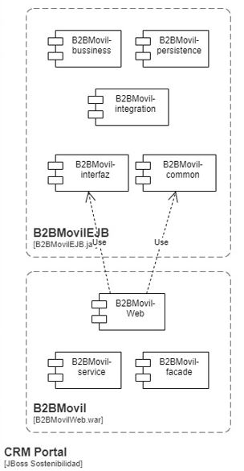
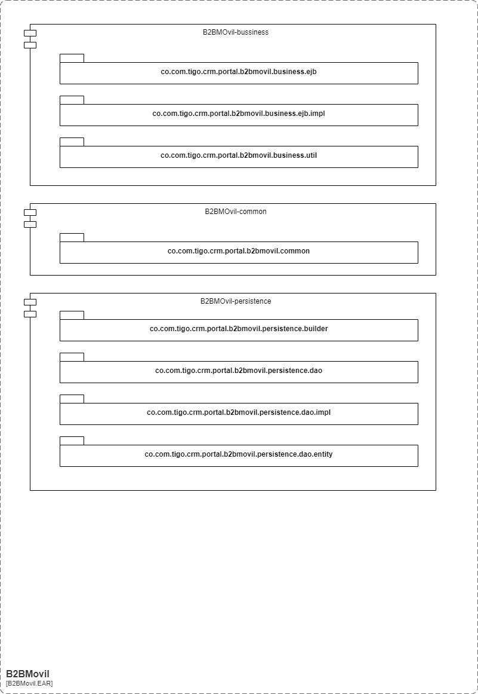
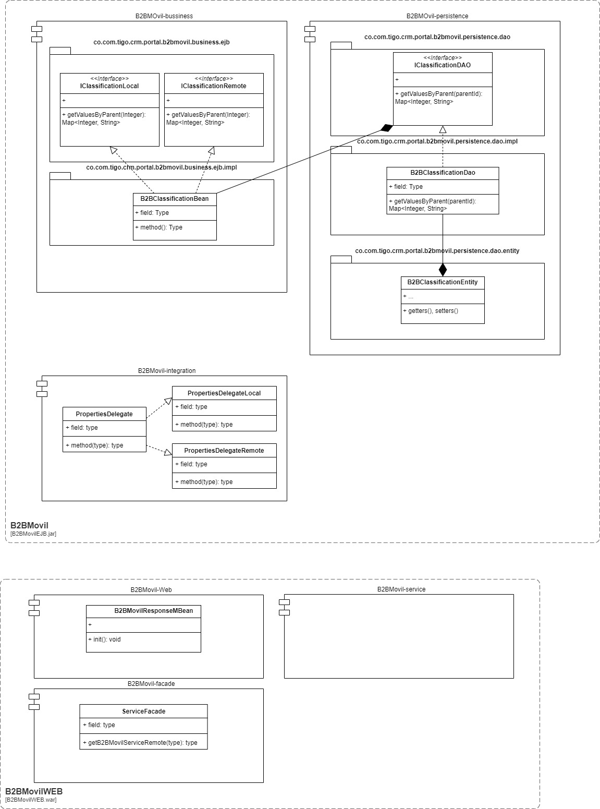
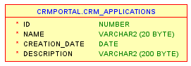
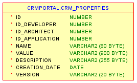
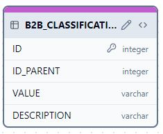
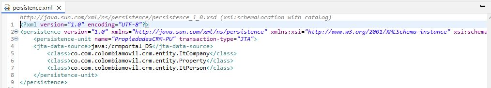
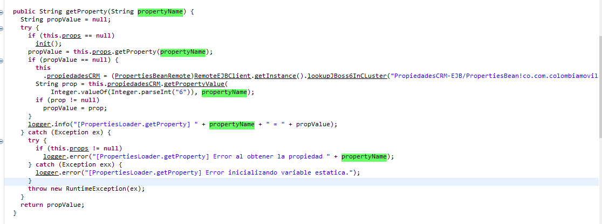

# Diseño técnico Parametrización. 

## Requisitos Impactados 

* RF-001
* RF-003
* RF-004
* RF-005
* RF-006
* RF-007
* RF-008
* RF-009
* RF-010
* RF-011

## Nuevo Pospago B2B / Parametrización

La solución técnica para la configuración de los parametros del B2BMovil esta soportada en 2 componentes. 

1. Properties CRM

> Será el encargado de gestionar las propiedades del B2BMovil. Cada propiedad es accedida a traves de una clave y un identificador de aplicación. 

2. Tabla CLASIFICADORES.

> Será el encargado de gestionar de las clasificaciones. Un clasificador es la configuración de valores que puede tener un parametro. 

### Properties CRM

Se hara uso del proyecto APP-PropiedadesCrm el cual contiene la estructura para gestionar las propiedades del sistema. 

El proyecto se encuentra en la ruta: 

http://gitlab2.tigoune.com:9004/Accenture-T2/CRMSostenibilidad/APP-PropiedadesCrm.git

La documentación del proyecto se encuentra en: 

https://tigoco.atlassian.net/wiki/spaces/DI/pages/697991445/PropiedadesCRM-EJB

Dentro de la documentación se indica como se debe incluir el proyecto como dependencia. A continuación se cita dicha información: 

#### PropiedadesCRM-EJB.jar: 

Para hacer uso del jar se debe incluir la siguiente dependencia en el proyecto maven con un scope provided. Esto para compilar proyectos en tiempo de ejecución se despliega componente en los EAP Back de Sostenibilidad

> <b>groupId:</b>co.com.tigo.crm.PropiedadesCRM 
<b>artifactId:</b>PropiedadesCRM-EJB 
<b>version:</b>1.0.0 
<b>scope:</b>provided 

### Modelo de Clasificaciones 

Se implementará el modelo de CLASIFICADORES para parametrizar los valores de un parametro. 

## Casos de uso(opcional)
    
    <Describa los pasos o las actividades que deberán realizarse para solución a los requisitos especificados. Los casos de uso no son obligatorios, estos se realizan cuando se considere necesario dar claridad sobre las acciones a ejecutar en el sistema>

* Nombre:	
* Complejidad:
* Alta
* Descripción:
* Actores:
* Sistema	Documentos asociados:
* Precondiciones:
* Post-condiciones:
* Reglas de Negocio
* Flujo básico:
* Flujos alternos:
* Manejos de situaciones anormales:
* Trazabilidad con requisitos

## Diagrama de componentes

El diagrama de componentes se encuentra soportado en la arquitectura expuesta en: 

https://tigoco.atlassian.net/wiki/spaces/DI/pages/697991563/Manual+creaci+n+componente

Al final, se encontraran los siguientes componentes: 

## Diagrama de paquetes

## Diagrama de clases

> 

## Descripción detallada del cambio a nivel de bases de dato

Para la configuración de las parametrizaciones se consideraran 3 tablas del schema CRM_PORTAL

<b>CRM_APPLICATIONS</b>: Contiene la información de las aplicaciones. 

<b>CRM_PROPERTIES</b>: Contiene la descripcion de las propiedades de una aplicación. 

<b>B2B_CLASSIFICATION</b>: Contiene la descripcion de una clasificacion. 

### Diagrama E-R

+ TABLAS REQUERIDAS

>

>

> 
  

### Otros componentes (Índices / Procedimientos / Funciones / Paquetes): NO APLICA

### Datasource

> El datasource de la aplicación es: 
> + jndi-name="java:/crmportal_DS"
> + pool-name="crmportal_DS" 

### Persistence Context 

> El componente JDBC del producto B2B Movil es JPA.

> El persistence.xml contiene la siguiente configuración: 
> + persistence-unit: 
>   + name="PropiedadesCRM-PU" 
>   + transaction-type="JTA"
> + jta-data-source: java:/crmportal_DS
>   + class: 

-- Persistence context de ejemplo: 

### Descripción detallada del cambio a nivel de integraciones <b>NO APLICA</b>

### Diagrama de integraciones

> La integración entre B2BMovil y Properties CRM se realizará usando Beans Remotos

### Integraciones por servicios

> Para acceder a los servicios del Properties CRM se realizará a traves de lookup. 

### Integraciones por ETLs: <b>NO APLICA</b>

### Detalle a nivel de red (Solo para nuevas aplicaciones): <b>NO APLICA</b>

### Detalle a nivel de infraestructura (Solo para nuevas aplicaciones): <b>NO APLICA</b>

### Descripción detallada del cambio a nivel de configuraciones / parametrizaciones: <b>NO APLICA</b>

### Descripción Detallada del Cambio a Nivel de Seguridad: <b>NO APLICA</b>

### Modelo de Amenazas: <b>NO APLICA</b>
   
